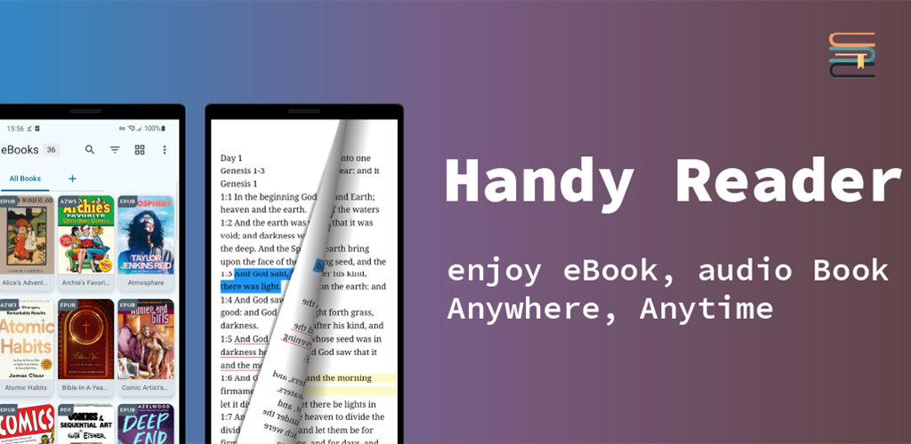

---
[download](https://play.google.com/store/apps/details?id=com.wxn.reader)
---

## 👀 Overview

---

## Features

- Support for EPUB/MOBI/AZW/AZW3/FB2/TXT/MD/PDF/Mp3 format
- Material You design
- Color picker functionality
- Room database integration for local storage
- Jetpack Compose UI
- Hilt dependency injection
- Coil for image loading
- Datastore for preferences
- Paging support

--- 

## TODO

- [√] Add page-turning animation speed control option
- [√] Add volume key page-turning feature toggle
- [√] Modify color selection panel
- [√] Optimaze TTS server and add setter
- [√] Add Reading Page background image selection to gallary
- [ ] Add font selection
- [√] Control the maximum height of popup for in-page annotation content
- [ ] Continuous vertical scrolling
- [ ] Add welcome guide on first app launch
- [√] Add control guide on first entering the reading interface
- [ ] Modify storage directory and file loading method
- [ ] Add WebDAV synchronization
- [ ] UI redesign and optimization
- [ ] Add in-app third-party translation display
- [ ] Add WebView to display web content
- [ ] support two column page diaplay on tablet
- [ ] support open mobi/epub.. file from third app
- [ ] offline AI TTS and Online EdgeTTS

---

## License

This project is licensed under the GNU General Public License v3.0 - see the [LICENSE](LICENSE) file for details.

---

## Acknowledgments

- [Skydoves](https://github.com/skydoves) for the ColorPicker Compose library
- [Shivamdhuria](https://github.com/Shivamdhuria) for the Palette library
- [androidSpeech](https://github.com/gotev/android-speech) for the text-to-Speech
- [libmobi](https://github.com/bfabiszewski/libmobi) for the libmobi library
- [tidyHtml5](https://github.com/htacg/tidy-html5) for the tidy-html5 library
- [utfcpp](https://github.com/nemtrif/utfcpp) for the utfcpp library
- [CssParser](https://github.com/luojilab/CSSParser) for the CssParser library
- [unzip](http://www.winimage.com/zLibDll/minizip.html) for the unzip library
- [jp2ForAndroid](https://github.com/EucWang/jp2ForAndroid) for the jp2ForAndroid
- [libxml2](https://github.com/GNOME/libxml2) for the libxml2 library
